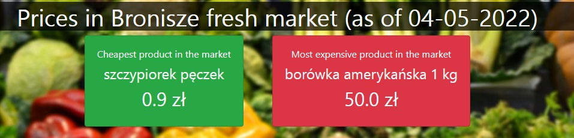
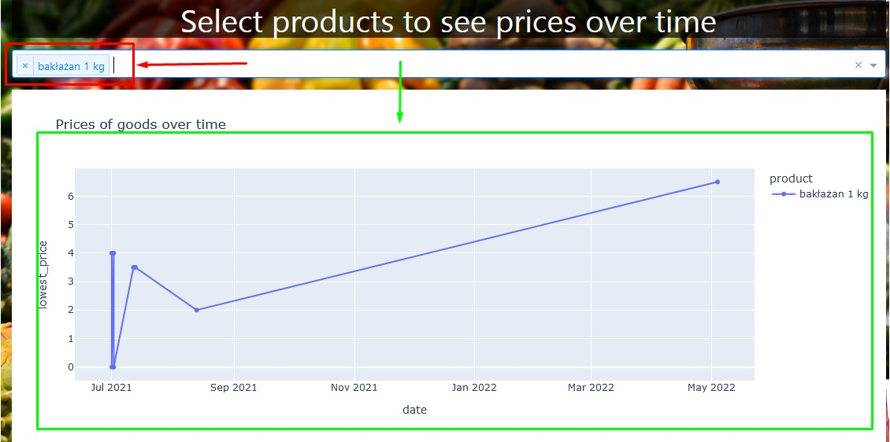
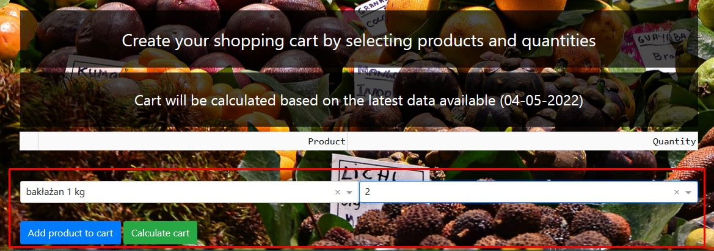
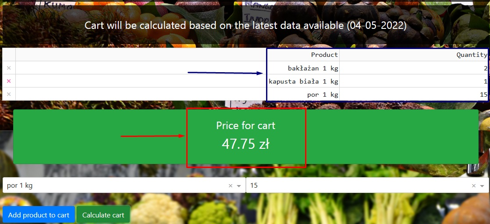

# Dashboard for fresh produce markets

## Assumption of the project
Usage of data gathered by fetching prices from 3 fresh produce markets in Poland (Zjazdowa, Bronisze, Elizówka)

## Dashboard options
1. Possibility to switch between markets by using tabs

2. Dashboards generates information about the least expensive and the most expensive products as of the latest update

3. Option to select a product using dropdown and see price changes over time

4. Feature allowing user to select desired products (with quantities)

 
In order to create a cart and generate the total cost for selected products

## Technologies
* Python (pandas, plotly)